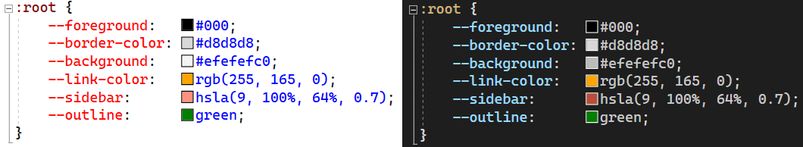

[marketplace]: https://marketplace.visualstudio.com/items?itemName=MadsKristensen.ColorPreview
[vsixgallery]: http://vsixgallery.com/extension/EditorColorPreview.06059b78-ceae-4188-905d-be8877234e35/
[repo]:https://github.com/madskristensen/EditorColorPreview

# Color Preview for Visual Studio

Download this extension from the [Visual Studio Marketplace][marketplace]
or get the [CI build][vsixgallery].

--------------------------------------

Shows a color preview in front of all named colors, hex, rgb and hsl values in CSS and JavaScript files.

 
***Figure 1**: Color preview in light theme and dark theme*

## Supported colors
These color formats are supported:

- Named colors (e.g. `blue`)
- Hex 3 digits (e.g. `#ff0`)
- Hex 6 digits (e.g. `#ffff00`)
- Hex 8 digits (e.g. `#ffff00cc`)
- RGB (e.g. `rgb(255, 165, 0)`)
- RGBA (e.g. `rgb(255, 165, 0, 0.5)`)
- HSL (e.g. `hsl(9, 100%, 64%);`)
- HSLA (e.g. `hsla(9, 100%, 64%, 0.7);`)

## How can I help?
If you enjoy using the extension, please give it a ★★★★★ rating on the [Visual Studio Marketplace][marketplace].

Should you encounter bugs or if you have feature requests, head on over to the [GitHub repo][repo] to open an issue if one doesn't already exist.

Pull requests are also very welcome, since I can't always get around to fixing all bugs myself. This is a personal passion project, so my time is limited.

Another way to help out is to [sponsor me on GitHub](https://github.com/sponsors/madskristensen).